# Film-Juicer

<p align="center">
  
</p>

<p align="center">
  <strong>Spectral photochemical film simulation for DaVinci Resolve</strong>
</p>

> [!IMPORTANT]
> Film-Juicer is built on **[spektrafilm](https://github.com/andreavolpato/spektrafilm)** by [Andrea Volpato](https://github.com/andreavolpato). Film-Juicer would not have been possible without Andrea's research, photographic modeling, profile work, and open-source reference implementation.

Film-Juicer is a Windows CUDA OpenFX plug-in that brings the spektrafilm negative, print, and scan pipeline into DaVinci Resolve. It reconstructs scene-linear RGB as spectra, exposes modeled film layers, develops dye density, optionally prints through a spectral enlarger, and scans the resulting medium back to RGB.

**This is not a LUT.** The result emerges from modeled exposure, spectral sensitivity, characteristic curves, dye density, illuminants, filtration, development interactions, texture, and scanning.

> [!NOTE]
> Film-Juicer is currently preparing for its first public release. The Windows installer will be published here when it is ready.

## Highlights

- Spectral film exposure sampled at 81 wavelengths from 380–780 nm
- Negative and positive capture-film profiles
- Direct-film and optical-print scan routes
- 20 capture-film profiles and 8 print-media profiles
- Hanatos 2025 and Mallett 2019 spectral reconstruction
- Profile-driven characteristic curves, dye densities, and illuminants
- DIR couplers with same-layer, inter-layer, and spatial behavior
- Density-domain, format-scaled film grain
- Profile-derived emulsion scatter and halation
- Camera and enlarger diffusion filters
- Spectral enlarger filtration, print exposure, and preflash
- Scanner correction, glare, blur, sharpening, and spectral LUT acceleration
- Film and gate artifacts including weave, dust, and scratches

## System requirements

- Windows 10/11 x64
- DaVinci Resolve with CUDA rendering
- NVIDIA Turing / SM75 or newer

## Installation

The public release will use a Windows installer:

1. Download the latest Film-Juicer installer from the GitHub Releases page.
2. Run the installer.
3. Restart DaVinci Resolve.

Film-Juicer will appear in Resolve under **OpenFX → Negative-juice → Juicer**.

The installer package has not been uploaded yet. This section will link directly to the first release when it becomes available.

## Quick start

1. Add **Juicer** to a node.
2. Set **Input color space** to match the RGB signal entering the plug-in.
3. Enable **Decode input CCTF** only when the incoming signal uses a supported nonlinear display encoding.
4. Select a **Film stock**.
5. Choose a **Scan route**.
6. For a print route, select a **Print paper** and adjust the enlarger and print controls.
7. Set the output color space and encoding for your Resolve workflow.

Start with exposure, stock, route, and color management. Once the base response is where you want it, shape DIR, grain, diffusion, halation, glare, and physical artifacts.

## Scan routes

Film-Juicer supports four explicit routes. The selected capture profile determines whether the film is negative or positive.

| Route | Photographic path |
| --- | --- |
| **Negative direct scan** | Negative film → scanner |
| **Negative print scan** | Negative film → enlarger → print medium → scanner |
| **Positive direct scan** | Positive film → scanner |
| **Positive print scan** | Positive film → enlarger → print medium → scanner |

The default workflow is a negative film printed to a selected paper or print-film profile and then scanned.

## Color management

Film exposure should be driven by scene-linear light. Film-Juicer can decode supported input transfer functions, but it does not treat log working encodings such as DaVinci Intermediate or ACEScct as scene-linear.

Supported input color spaces:

- DaVinci Wide Gamut
- ITU-R BT.2020
- ACES2065-1
- sRGB / Rec.709

### Resolve Color Management or ACES

1. Ensure that the signal entering Film-Juicer is scene-linear. If the timeline signal is log-encoded, use a Color Space Transform before the plug-in.
2. Select the matching input primaries in Film-Juicer.
3. Leave **Decode input CCTF** off for an already-linear signal.
4. Enable **Output linear pass-through**.
5. Let Resolve perform the timeline and display transforms after Film-Juicer.

### Explicit display-referred workflow

1. Select **sRGB / Rec.709** or **ITU-R BT.2020** as the input color space.
2. Enable **Decode input CCTF** when the incoming values are display encoded.
3. Select the desired output color space.
4. Enable **Apply output CCTF** for display-encoded delivery.

Film-Juicer can output sRGB, DCI-P3, Display P3, Adobe RGB, BT.2020, ProPhoto RGB, ACES2065-1, DaVinci Wide Gamut Intermediate, or Rec.709.

## The photographic pipeline

```mermaid
flowchart LR
    A[Input RGB] --> B[Linearize and convert]
    B --> C[Spectral reconstruction]
    C --> D[Camera diffusion and capture-film exposure]
    D --> E[Scatter and halation]
    E --> F[Film development and DIR]
    F --> G[Film grain and artifacts]
    G --> H{Scan route}
    H -->|Direct| K[Film scan]
    H -->|Print| I[Spectral enlarger exposure]
    I --> O[Print diffusion]
    O --> J[Print development]
    J --> L[Print scan]
    K --> M[Scanner finishing]
    L --> M
    M --> N[Output color transform]
```



### 1. RGB to spectral exposure

Film layers respond to wavelength-dependent light, not RGB primaries. Film-Juicer converts the incoming RGB value into film-layer exposure using one of two reconstruction methods:

- **Hanatos 2025** uses a precomputed visible-locus spectral LUT and is the default.
- **Mallett 2019** reconstructs spectra from a compact set of basis functions.

The selected film profile supplies the red-, green-, and blue-sensitive layer responses, reference illuminant, and optional UV/IR filtering used during exposure.

### 2. Film development and DIR

Layer exposure is converted into developed density through the selected stock's characteristic curves. The resulting cyan, magenta, and yellow dye densities form the spectral absorption of the developed film.

Developer-inhibitor-releasing couplers model interactions within and between the film layers. Spatial DIR allows those interactions to spread across the film plane, affecting color separation, local contrast, and perceived sharpness.

### 3. Grain and film-plane effects

Grain is generated in film-density space rather than overlaid on the finished RGB image. Particle statistics, sublayers, density, dye-cloud blur, clumping, and film format all contribute to its appearance before the image reaches the print or scanner stage.

Film-local dust and scratches travel with the film strip. Gate-local dust, scratches, and weave remain tied to the virtual camera or scanner gate.

### 4. Optical print

On a print route, the developed capture film becomes a spectral filter in a virtual enlarger. The enlarger combines its illuminant with a neutral calibration and user Y/M/C filtration before exposing the selected paper or print film.

The Y, M, and C controls are offsets in Kodak CC units around the calibrated neutral position. Print exposure, preflash, and exposure compensation operate before the print medium is developed through its own sensitivity and density curves.

### 5. Scan and output

The scanner converts developed film or print density back into color under a viewing illuminant. Spectral density is integrated to CIE XYZ and transformed into the selected output RGB space.

Scanner finishing includes route-specific black and white correction, spectral LUT acceleration, glare, lens blur, unsharp masking, output color conversion, and optional transfer-function encoding.

## Controls by stage

### Camera and exposure

- **Camera auto exposure** meters the incoming image before film exposure.
- **Camera metering** offers center-weighted, average, median, partial, matrix, multi-zone, and highlight-weighted methods.
- **Exposure Compensation Ev** adjusts capture exposure in stops; +1 EV doubles exposure.
- **Camera film format (mm)** sets the physical scale used by grain, DIR, diffusion, halation, and other film-plane effects.

### Film and spectral reconstruction

- **Film stock** selects the capture profile.
- **Spectral upsampling** selects Hanatos or Mallett reconstruction.
- **Reference illuminant** determines the reference light used by the film-exposure model.
- **DIR couplers** control same-layer and inter-layer inhibition, strength, and spatial diffusion.

### Print and enlarger

- **Scan route** chooses direct scanning or optical printing for negative or positive film.
- **Print paper** selects a paper or print-film profile.
- **Enlarger illuminant** selects the enlarger light source.
- **Dichroic filter set** selects the spektrafilm reference filter model or a measured filter set.
- **Enlarger Y/M/C offsets** adjust filtration around the neutral calibration in Kodak CC units.
- **Print exposure**, **preflash**, and **exposure compensation** shape the exposure entering print development.

### Halation and diffusion

- **Halation** uses the selected film profile's anti-halation and scatter parameters, with amount and spatial-scale controls. It is off by default.
- **Camera diffusion** operates before film development.
- **Print diffusion** operates in the enlarger/print-exposure stage.
- Diffusion families include Glimmerglass, Black Pro-Mist, Pro-Mist, and CineBloom, with controls for core, halo, bloom, warmth, and scale.

### Grain and artifacts

- **Grain presets** provide fine, medium, and coarse starting points.
- **Grain Amount, Size, Sharpness, Chroma, and Texture** are the principal creative controls.
- Advanced controls expose particle area, sublayers, density, uniformity, dye-cloud blur, size mixtures, and micro-structure.
- **Gate weave**, **film/gate dust**, and **film/gate scratches** model transport and physical contamination.

### Scanner and output

- **Scanner use LUT** accelerates spectral density-to-color conversion.
- **Scanner LUT resolution** trades memory and preparation time for precision.
- **Scanner black/white correction** controls route-specific normalization.
- **Glare** models scanner-stage veiling light.
- **Scanner lens blur** and **unsharp mask** control final optical softness and sharpening.
- **Output color space**, **Apply output CCTF**, and **Output linear pass-through** define the handoff back to Resolve.

## Included profiles

Film-Juicer currently ships with 20 capture-film profiles and 8 print-media profiles derived from the spektrafilm profile set.

### Capture film

- Fujifilm C200, Pro 400H, Provia 100F, Velvia 100, and X-Tra 400
- Kodak Ektachrome 100, Ektar 100, Gold 200, Kodachrome 64, Ultramax 400, and Verita 200D
- Kodak Portra 160, 400, and 800, including Portra 800 Push 1 and Push 2 profiles
- Kodak Vision3 50D, 200T, 250D, and 500T

### Print media

- Fujifilm Crystal Archive Type II
- Kodak Vision 2383 and Vision Premier 2393
- Kodak Ektacolor Edge
- Kodak Professional Endura Premier, Portra Endura, Supra Endura, and Ultra Endura

## Performance

Film-Juicer is a multi-stage spectral renderer. Spatial DIR, grain, diffusion, halation, glare, and large blur radii add GPU work and can become significant at high resolutions.

For interactive grading:

- Establish the stock, route, exposure, and print balance first.
- Enable **Scanner use LUT**.
- Add spatial and stochastic effects after the base color response is established.
- Judge grain and other physically scaled effects at the intended output resolution.

## Building from source

The current Windows build uses:

- Visual Studio 2026 / MSVC v145 or ClangCl
- CUDA Toolkit 13.2
- C++20 for host and CUDA code
- OpenFX 1.4 headers and the OpenFX support library
- Eigen 3.4

Build the Visual Studio solution from a configured developer environment:

```powershell
& "C:\Program Files\Microsoft Visual Studio\18\Community\MSBuild\Current\Bin\MSBuild.exe" juicer.sln /p:Configuration=Release /p:Platform=x64
```

The optimized plug-in bundle is produced under `juicer/x64/Release`.

## Project status

Film-Juicer is under active development as its historical agx-emulsion behavior is replaced by the current spektrafilm model. The public contract is the spektrafilm-based CUDA pipeline described in this README.

The project is not intended to duplicate every workflow or UI feature of the Python reference application or other spektrafilm integrations. Its focus is a native, high-performance DaVinci Resolve implementation with Film-Juicer's own GPU grain and physical-artifact controls.

## Credits and acknowledgements

Film-Juicer stands on the work of many researchers and open-source contributors. In particular:

- **Andrea Volpato** created [spektrafilm](https://github.com/andreavolpato/spektrafilm), the behavioral reference, photographic model, and source of the profile framework on which Film-Juicer is built.
- **Johannes Hanika (Hanatos)** developed the visible-locus spectral reconstruction direction used by the Hanatos path.
- **Mallett and Cem Yuksel** authored *Spectral Primary Decomposition for Rendering with sRGB Reflectance* (2019), the basis of the Mallett reconstruction path.

If Film-Juicer is useful to you, please visit, star, and support the original [spektrafilm project](https://github.com/andreavolpato/spektrafilm).

## License

spektrafilm source code is licensed under GPL-3.0, while profiles and other upstream assets carry their respective spektrafilm terms. Film-Juicer's repository-level license and third-party notices will be finalized before the first public release.

## References

- [spektrafilm — reference implementation](https://github.com/andreavolpato/spektrafilm)
- [spektrafilm OFX technical overview](https://spektrafilm.114c.de/technical/)
- [Mallett and Yuksel — Spectral Primary Decomposition for Rendering with sRGB Reflectance](https://diglib.eg.org/items/bbffa865-e99c-4c1f-bd33-70102dc8af78)
- Giorgianni and Madden — *Digital Color Management*, 2nd edition
- Hunt — *The Reproduction of Colour*, 6th edition
