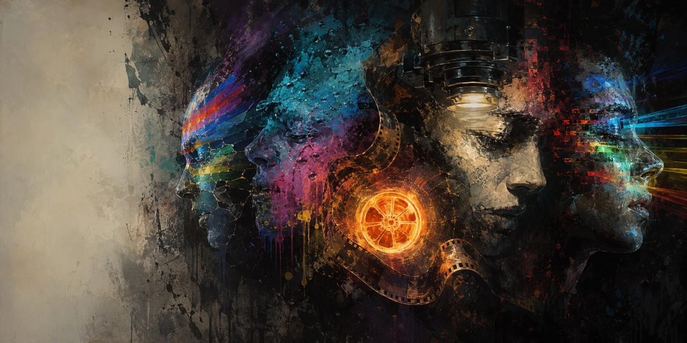
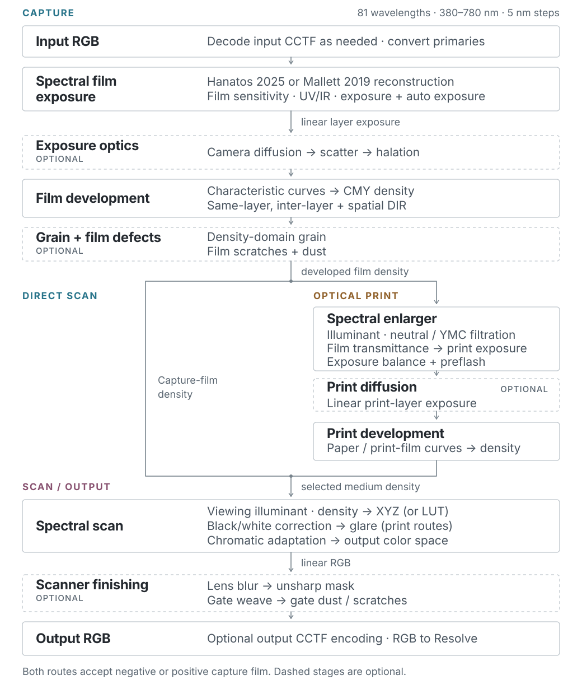
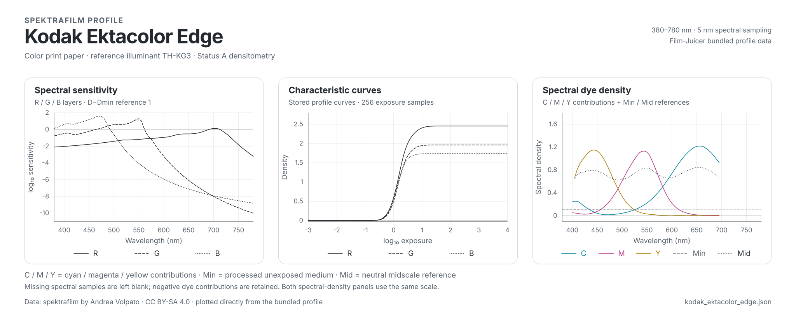

<h1 align="center">Film-Juicer</h1>

<p align="center">
  
</p>

<p align="center">
  <strong>Spectral photochemical film simulation for DaVinci Resolve</strong>
</p>

> [!IMPORTANT]
> Film-Juicer is built on **[spektrafilm](https://github.com/andreavolpato/spektrafilm)** by [Andrea Volpato](https://github.com/andreavolpato). Most of the difficult work happened before Film-Juicer existed: the research, the photographic model, the profile work, and the reference implementation. Without that, there would be very little here besides a stupidly ambitious idea.

Film-Juicer is a Windows CUDA OpenFX plug-in for DaVinci Resolve. It takes scene-linear RGB, reconstructs spectra from it, exposes modeled film layers, develops those exposures into dye density, optionally sends the resulting film through an enlarger and print medium, and finally scans the thing back into RGB.

That is an unnecessarily complicated way of making a picture.

It is also rather close to the point.

**Film-Juicer is not a single input-to-output look LUT.** It does use LUTs internally where a table is a useful numerical shortcut, but there is no table somewhere containing the correct answer for "Portra." The result falls out of a sequence of modeled operations: exposure, spectral sensitivity, characteristic curves, dye formation, filtration, illuminants, development interactions, grain, scatter, halation, printing and scanning. Change something early in the chain and the consequences continue downstream.

This is considerably more troublesome than mapping one RGB value to another. Good.

> [!NOTE]
> Film-Juicer is currently preparing for its first public release. The Windows installer will be published here when it is ready.

## Highlights

The short version:

- Spectral film exposure sampled at 81 wavelengths from 380–780 nm
- Negative and positive capture-film profiles
- Direct-film and optical-print scan routes
- 20 capture-film profiles and 8 print-media profiles
- Hanatos 2025 and Mallett 2019 spectral reconstruction
- Profile-driven characteristic curves and dye densities
- DIR couplers with same-layer, inter-layer, and spatial behavior
- Density-domain, format-scaled film grain
- Profile/model-driven emulsion scatter and halation with user amount and spatial-scale controls
- Camera and enlarger diffusion filters
- Spectral enlarger filtration, print exposure, and preflash
- Scanner correction, print-scan glare, blur, sharpening, and spectral LUT acceleration
- Film and gate artifacts including weave, dust, and scratches

Some of this exists because it is central to the photographic model. Some of it exists because once you have already built the enlarger, adding dust to the gate starts to seem perfectly reasonable.

This is how these things happen.

## System requirements

Film-Juicer is not especially interested in modest hardware.

- Windows 10/11 x64
- DaVinci Resolve with CUDA rendering
- NVIDIA Turing / SM75 or newer

## Installation

The public release will use a Windows installer:

1. Download the latest Film-Juicer installer from the GitHub Releases page.
2. Run the installer.
3. Restart DaVinci Resolve.

Film-Juicer will appear in Resolve under **OpenFX → Negative-juice → Juicer**.

The installer package has not been uploaded yet. This section will link directly to the first release when it becomes available.

There should not be anything clever about installation. The cleverness belongs elsewhere.

## Quick start

You do not need to understand every control before getting a sensible image out of Film-Juicer. In fact, trying to adjust everything at once is a very efficient way of making it impossible to tell what anything does.

Start here:

1. Add **Juicer** to a node.
2. Set **Input color space** to match the RGB signal entering the plug-in.
3. Enable **Decode input CCTF** only when the incoming signal uses a supported nonlinear display encoding.
4. Select a **Film stock**.
5. Choose a **Scan route**.
6. For a print route, select a **Print paper** and adjust the enlarger and print controls.
7. Set the output color space and encoding for your Resolve workflow.

Get exposure, stock, route, and color management right first.

Then start touching DIR, grain, diffusion, halation, glare, dust, scratches and the other things that make the clean mathematical image progressively less clean and mathematical.

If the basic rendering is wrong, adding more effects will mostly give you a more complicated wrong rendering.

## Scan routes

Film-Juicer has four explicit routes. The selected capture profile determines whether the film is negative or positive.

| Route                    | Photographic path                                 |
| ------------------------ | ------------------------------------------------- |
| **Negative direct scan** | Negative film → scanner                           |
| **Negative print scan**  | Negative film → enlarger → print medium → scanner |
| **Positive direct scan** | Positive film → scanner                           |
| **Positive print scan**  | Positive film → enlarger → print medium → scanner |

The default workflow is a negative film printed to a selected paper or print-film profile and then scanned.

You can take the shorter road and scan the film directly. The longer road has an enlarger, another photosensitive medium, another development stage, and several more opportunities for the image to change on the way through.

Naturally, that is the default.

## Color management

This part is boring until it is wrong. Then it becomes the only thing that matters.

Film exposure should be driven by scene-linear light. Film-Juicer can decode supported input transfer functions, but it does not treat log working encodings such as DaVinci Intermediate or ACEScct as scene-linear, because they are not.

Supported input color spaces:

- DaVinci Wide Gamut
- ITU-R BT.2020
- ACES2065-1
- sRGB / Rec.709
### Resolve Color Management or ACES

1. Ensure that the signal entering Film-Juicer is scene-linear. If the timeline signal is log-encoded, use a Color Space Transform before the plug-in.
2. Select the matching input primaries in Film-Juicer.
3. Leave **Decode input CCTF** off for an already-linear signal.
4. Set Film-Juicer's **Output color space** and **Apply output CCTF** state to match the signal you want to hand back to Resolve.
5. Keep any downstream Resolve transforms consistent with that handoff.

### Explicit display-referred workflow

1. Select **sRGB / Rec.709** or **ITU-R BT.2020** as the input color space.
2. Enable **Decode input CCTF** only when the incoming signal uses the transfer function Film-Juicer actually supports for that entry.
3. Select the desired output color space.
4. Enable **Apply output CCTF** for display-encoded delivery.

The input decoder is deliberately limited. The **sRGB / Rec.709** entry uses the sRGB CCTF; it is not a generic decoder for every Rec.709 workflow. **ITU-R BT.2020** uses the BT.2020 transfer function. DaVinci Intermediate, ACEScct, gamma-encoded Rec.709 workflows, and other log or display encodings should be linearized in Resolve before Film-Juicer.

Film-Juicer can output sRGB, DCI-P3, Display P3, Adobe RGB, BT.2020, ProPhoto RGB, ACES2065-1, DaVinci Wide Gamut Intermediate, or Rec.709.

The important bit is not what the drop-down says. The important bit is that the numbers entering the film model mean what the film model thinks they mean.

Computers are remarkably tolerant of nonsense right up until they produce it for you.

## The photographic pipeline

The pipeline is deliberately fairly literal:



It is tempting with software like this to think of the controls as a collection of independent looks. They are not. Most of them live somewhere specific in the imaging chain, and where they live matters.

Camera diffusion acting on film-linear exposure before development is not the same operation as blurring the scan afterwards. Grain before printing is not the same thing as adding noise to the final RGB image. Enlarger filtration does not become equivalent to an arbitrary color correction just because both can make something more yellow.

The order is part of the model.

### What a profile actually contains

The stock name is the least interesting part of a profile.

A spektrafilm profile describes several different pieces of photographic behavior which Film-Juicer uses at different points in the pipeline. Spectral sensitivity determines how wavelength-dependent light contributes to exposure in the modeled layers. Characteristic curves describe how those layer exposures become developed density. Spectral-density data describes how the processed material itself absorbs light after development.

Kodak Portra 800 is a useful example:

<p align="center">
  
</p>

<p align="center"><sub>Kodak Portra 800 profile data. From left to right: spectral sensitivity, stored characteristic curves, and C/M/Y dye-density contributions with Min/Mid reference spectra.</sub></p>

The three panels are not three different ways of drawing the same "Portra look." They describe different parts of the material model, and they are consumed at different stages of the pipeline. The right-hand panel shows the profile's cyan, magenta, and yellow dye-density contributions (**C**, **M**, **Y**), plus the spectral density of the processed unexposed medium (**Min**) and the neutral midscale reference (**Mid**). C/M/Y are the channel contributions used to build the medium's spectral density; Min and Mid are reference spectra, not additional dye channels. Missing source samples are left blank, and negative dye contributions are retained, consistent with spektrafilm's treatment of masking couplers.

These figures plot the data bundled with Film-Juicer: `log_sensitivity`, the stored `density_curves`, and `channel_density` plus `base_density` and `midscale_neutral_density`. The characteristic panel uses the stored curves directly; it does not reconstruct them from the separate fitted layer model.

None of this contains the final answer for Portra 800. It contains ingredients. Film-Juicer still has to expose the material, develop it, pass light through it, print it or scan it, and let the consequences accumulate.

### 1. RGB to spectral exposure

The input to Film-Juicer is RGB. Film, inconveniently, does not expose itself to RGB.

Film layers respond to wavelength-dependent light, so Film-Juicer reconstructs spectra from the incoming RGB values and uses those spectra to determine exposure in the modeled red-, green-, and blue-sensitive layers.

Two reconstruction methods are available:

- **Hanatos 2025** uses a precomputed visible-locus spectral LUT and is the default, particularly for wide-gamut input.
- **Mallett 2019** reconstructs spectra from a compact set of basis functions after conversion to linear sRGB. It is therefore limited by the sRGB gamut and is best treated as the narrower alternative path.

The selected film profile supplies the spectral sensitivity data used by the exposure model. Optional camera UV/IR filtration can further modify the effective sensitivity before exposure is calculated.

The reconstruction is not an attempt to divine the original spectrum from three numbers. That information is gone. What it gives us is a plausible spectral representation that can be passed into a model whose behavior actually depends on wavelength.

That is enough to make things interesting.

### 2. Film development and DIR

Layer exposure is converted into developed density through the selected stock's characteristic curves. Cyan, magenta, and yellow dye densities form the spectral absorption of the developed film.

So far, reasonably civilised.

Then the layers start interfering with each other.

Developer-inhibitor-releasing couplers model interactions within and between film layers. Spatial DIR allows those interactions to spread across the film plane, which can affect color separation, local contrast, and apparent sharpness.

This is one of the reasons the pipeline is built as a sequence of physical-ish stages rather than a pile of final-image adjustments. Something can alter the image not because it directly changes the final pixel, but because it changes what the next stage receives.

Cause, consequence, more consequence.

### 3. Grain and film-plane effects

Grain is generated in film-density space rather than pasted over the finished RGB image.

That sounds like an unnecessarily fussy distinction until you start printing the negative, changing film format, blurring dye clouds, or doing anything else where the grain should participate in later stages instead of hovering above them like a Photoshop layer.

Particle statistics, sublayers, density, dye-cloud blur, clumping, and film format all contribute to its appearance before the image reaches the print or scanner stage.

Physical scale matters here. A 35 mm negative and an 8×10 sheet are not different merely because somebody typed another number into an EXIF field.

Film-local dust and scratches travel with the film strip. Gate-local dust, scratches, and weave remain tied to the virtual camera or scanner gate.

This sounds like the sort of distinction nobody needs until the gate starts moving and the scratch moves with the wrong thing.

Then you need it.

### 4. Optical print

On a print route, the developed capture film becomes a spectral filter in a virtual enlarger.
The enlarger combines its illuminant with a calibrated neutral position and user Y/M/C filtration before exposing the selected paper or print film. The Y, M, and C controls are offsets in Kodak CC units around that neutral position.

Print exposure, preflash, and exposure compensation operate before the print medium is developed through its own sensitivity and density curves.

There is an appealingly stupid amount of machinery involved in reproducing the fact that, historically, somebody shone a lamp through a negative onto another piece of photosensitive material.

But that intermediate step matters. The print is not merely the negative with a tone curve attached to it. The negative modulates the enlarger spectrum, the print medium sees that spectrum through its own sensitivities, and the result develops into another set of densities.

Light has to make the trip.

Ektacolor Edge shows what the other end of that trip looks like:

<p align="center">
  
</p>

<p align="center"><sub>Kodak Ektacolor Edge print-medium profile. Like the capture film, the print material has its own spectral sensitivity, stored characteristic curves, and C/M/Y dye-density contributions with Min/Mid reference spectra.</sub></p>

The negative does not hand RGB values to a generic print curve. It filters the enlarger spectrum; that spectrum exposes the print layers; and those exposures develop according to the print profile. The very different characteristic behavior of Portra 800 and Ektacolor Edge is therefore not a cosmetic difference between two presets. They are different photosensitive materials doing different jobs.

### 5. Scan and output

Eventually all of this needs to come back to RGB, otherwise DaVinci Resolve is going to be rather unhappy with us.

The scanner converts developed film or print density back into color under a viewing illuminant. Spectral density is integrated to CIE XYZ and transformed into the selected output RGB space.

Scanner finishing includes route-specific black and white correction, spectral LUT acceleration, lens blur, unsharp masking, output color conversion, and optional transfer-function encoding. Print routes can also add scanner-stage glare.

The image starts as RGB and ends as RGB.

It is what happens in between that makes this whole exercise worth the electricity.

## Controls by stage

The controls are grouped roughly according to where they act in the pipeline.

This is also a decent way to debug a bad result: start near the beginning and work forward. Do not immediately compensate for one mysterious thing with three other mysterious things. That way lies madness, node trees with 47 corrections, and eventually blaming color management.

### Camera and exposure

- **Camera auto exposure** meters the incoming image before film exposure.
- **Camera metering** offers center-weighted, average, median, partial, matrix, multi-zone, and highlight-weighted methods.
- **Exposure Compensation Ev** adjusts capture exposure in stops; +1 EV doubles exposure.
- **Camera film format (mm)** sets the physical scale used by grain, DIR, diffusion, halation, and other film-plane effects.

### Film and spectral reconstruction

- **Film stock** selects the capture profile.
- **Spectral upsampling** selects Hanatos or Mallett reconstruction.
- Optional camera UV/IR filtration modifies the effective spectral sensitivity used for exposure.
- **DIR couplers** control same-layer and inter-layer inhibition, strength, and spatial diffusion.

### Print and enlarger

- **Scan route** chooses direct scanning or optical printing for negative or positive film.
- **Print paper** selects a paper or print-film profile.
- **Enlarger illuminant** selects the enlarger light source.
- **Dichroic filter set** selects the spektrafilm reference filter model or a measured filter set.
- **Enlarger Y/M/C offsets** adjust filtration around the neutral calibration in Kodak CC units.
- **Print exposure**, **preflash**, and **exposure compensation** shape the exposure entering print development.

### Halation and diffusion

- **Scatter and halation** combine profile/model parameters with user amount and spatial-scale controls. Halation is off by default.
- **Camera diffusion** operates on film-linear exposure before film development.
- **Print diffusion** operates on enlarger/print-linear exposure before print development.
- Diffusion families include Glimmerglass, Black Pro-Mist, Pro-Mist, and CineBloom, with controls for core, halo, bloom, warmth, and scale.

### Grain and artifacts

- **Grain presets** provide fine, medium, and coarse starting points.
- **Grain Amount, Size, Sharpness, Chroma, and Texture** are the principal creative controls.
- Advanced controls expose particle area, sublayers, density, uniformity, dye-cloud blur, size mixtures, and micro-structure.
- **Gate weave**, **film/gate dust**, and **film/gate scratches** model transport and physical contamination.

You are, of course, free to add a heroic quantity of dirt to the image.

The software will not stage an intervention.

### Scanner and output

- **Scanner use LUT** accelerates spectral density-to-color conversion internally; it does not turn the overall film simulation into a single look LUT.
- **Scanner LUT resolution** trades memory and preparation time for precision.
- **Scanner black/white correction** controls route-specific normalization.
- **Glare** models scanner-stage veiling light on print routes.
- **Scanner lens blur** and **unsharp mask** control final optical softness and sharpening.
- **Output color space** and **Apply output CCTF** define the handoff back to Resolve.

## Included profiles

Film-Juicer currently ships with 20 capture-film profiles and 8 print-media profiles derived from the spektrafilm profile set.

The names will be familiar. The useful part is not the name.

These profiles provide the data used by the model: sensitivities, characteristic behavior, dye information, illuminants and other stock-specific parameters. Selecting Portra 400 is therefore not the same thing as selecting a preset called "Portra 400" which somebody made by eyeballing a photograph of a gas station.

They are still models, not declarations that every roll, processing line, paper batch, enlarger, or scanner in the physical world has one immutable response. Film-Juicer inherits the measurements, fitted models, reference conditions, and limitations of the upstream profiles. The useful distinction is not "perfectly true film" versus "fake film." It is a rendering derived from a coherent photographic model rather than a final RGB look assembled by eye.

There is nothing inherently wrong with eyeballing gas stations. It is simply a different activity.

### Capture film

- Fujifilm C200, Pro 400H, Provia 100F, Velvia 100, and X-Tra 400
- Kodak Ektachrome 100, Ektar 100, Gold 200, Kodachrome 64, Ultramax 400, and Verita 200D
- Kodak Portra 160, 400, and 800, including Portra 800 Push 1 and Push 2 profiles
- Kodak Vision3 50D, 200T, 250D, and 500T

### Print media

- Fujifilm Crystal Archive Type II
- Kodak Vision 2383 and Vision Premier 2393
- Kodak Ektacolor Edge
- Kodak Professional Endura Premier, Portra Endura, Supra Endura, and Ultra Endura

## Performance

Film-Juicer does a lot of work.

There is no profound insight hidden in that sentence. Spectral calculations cost something. Spatial DIR costs something. Grain, diffusion, halation, glare, large blur radii and high resolutions all cost something. Eventually these somethings become milliseconds, and then those milliseconds become you staring at Resolve wondering why the GPU sounds like a small aircraft.
For interactive grading:

- Establish the stock, route, exposure, and print balance first.
- Enable **Scanner use LUT**.
- Add spatial and stochastic effects after the base color response is established.
- Judge grain and other physically scaled effects at the intended output resolution.

The GPU will suffer according to your ambitions.

Fortunately GPUs are manufactured specifically so that we may do unreasonable things to them.

## Building from source

The current Windows build uses:

- Visual Studio 2026 / MSVC v145 or ClangCl
- CUDA Toolkit 13.2
- C++20 for host and CUDA code
- OpenFX 1.4 headers and the OpenFX support library
- Eigen 3.4

Build the Visual Studio solution from a configured developer environment:

```powershell
& "C:\Program Files\Microsoft Visual Studio\18\Community\MSBuild\Current\Bin\MSBuild.exe" juicer.sln /p:Configuration=Release /p:Platform=x64
```

The linker produces `juicer.ofx` in the configured MSBuild output directory.

If you are building it yourself, you presumably already know that "just compile it" is one of computing's great lies. Still, that is the command.

## Project status

Film-Juicer is under active development as its historical agx-emulsion behavior is replaced by the current spektrafilm model.

The public contract is the spektrafilm-based CUDA pipeline described in this README. Old behavior does not automatically become sacred because it existed first. If something can be replaced by a cleaner, more coherent implementation of the current model, it probably should be.

At the same time, the goal is not to duplicate every workflow or every UI option from the Python reference application or from other spektrafilm integrations.

That would be an excellent way to turn one complicated program into two complicated programs.

Film-Juicer has a more specific job: bring the model into DaVinci Resolve, keep it native and GPU-driven, and provide the grain and physical-artifact controls that make sense for this implementation.

There is always another parameter that could be exposed. There is usually a less obvious question: would exposing it actually make the software better?

## Credits and acknowledgements

Film-Juicer did not appear out of the fog fully armed with spectral tables.

It sits on top of a lot of other people's work: research, measurements, code, profile building, experiments, papers and all the tedious checking that makes the interesting parts possible.

In particular:

- **Andrea Volpato** created [spektrafilm](https://github.com/andreavolpato/spektrafilm), the behavioral reference, photographic model, and source of the profile framework on which Film-Juicer is built.
- **Johannes Hanika (Hanatos)** developed the visible-locus spectral reconstruction direction used by the Hanatos path.
- **Mallett and Cem Yuksel** authored *Spectral Primary Decomposition for Rendering with sRGB Reflectance* (2019), the basis of the Mallett reconstruction path.

The profile figures in this README are Film-Juicer visualizations of spektrafilm profile data and fitted models. The underlying profile data remains subject to the upstream spektrafilm terms, including CC BY-SA 4.0 where applicable.

If Film-Juicer is useful to you, please visit, star, and support the original [spektrafilm project](https://github.com/andreavolpato/spektrafilm).

## License

spektrafilm source code is licensed under GPL-3.0, while profiles and other upstream assets carry their respective spektrafilm terms.

Film-Juicer's repository-level license and third-party notices will be finalized before the first public release.

Until then, the absence of the finished paperwork should not be interpreted as some sort of legal wilderness where everything may be carried away under cover of darkness.

## References

A few useful holes to disappear into:

- [spektrafilm — reference implementation](https://github.com/andreavolpato/spektrafilm)
- [Mallett and Yuksel — Spectral Primary Decomposition for Rendering with sRGB Reflectance](https://diglib.eg.org/items/bbffa865-e99c-4c1f-bd33-70102dc8af78)
- Giorgianni and Madden — *Digital Color Management*, 2nd edition
- Hunt — *The Reproduction of Colour*, 6th edition
